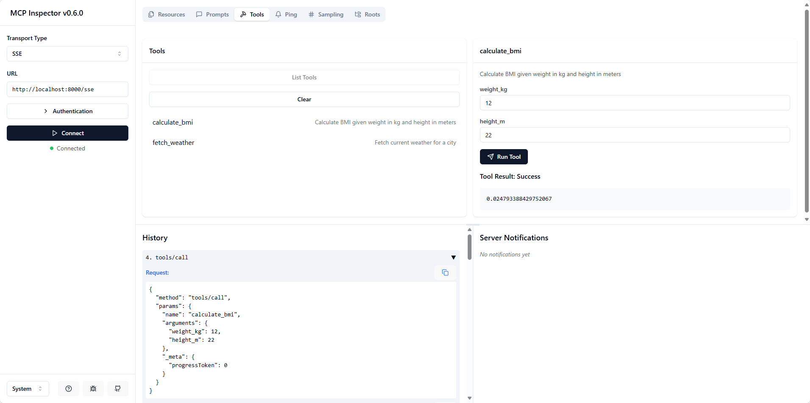

# MCP-YNU - FastMCP Server

A dynamic MCP server implementation using FastMCP that automatically loads tools, resources, and prompts from respective directories.

## Features

- Dynamic loading of modules from `tools/`, `resources/`, and `prompts/` directories
- Automatic discovery and registration of modules
- Simple configuration and extensibility
- Type hints for better code clarity and static analysis
- Comprehensive logging for monitoring server activity

## Recent Updates

- Added type hints throughout the codebase
- Improved MCP instance handling
- Added logging functionality
- Added MIT license
- Updated documentation with reference links

## Directory Structure

```
mcp-ynu/
├── tools/          # Directory for tool modules
│   ├── __init__.py
│   ├── example.py
├── resources/      # Directory for resource modules
│   ├── __init__.py
│   ├── example.py
├── prompts/        # Directory for prompt modules
│   ├── __init__.py
│   ├── example.py
├── logger.py       # Logger implementation
├── main.py         # Main implementation
├── mcp_server.py   # MCP server implementation
├── README.md       # Project documentation
├── LICENSE         # MIT License
└── pyproject.toml  # Project configuration
```

## Usage

1. Create modules in the appropriate directories
2. Import mcp via `from mcp_server import mcp` 
3. Run the server:

```bash
python main.py
```

## Example Modules

### Tools Module Example (tools/example.py)
```python
from mcp_server import mcp
import httpx

@mcp.tool()
def calculate_bmi(weight_kg: float, height_m: float) -> float:
    """Calculate BMI given weight in kg and height in meters"""
    return weight_kg / (height_m**2)


@mcp.tool()
async def fetch_weather(city: str) -> str:
    """Fetch current weather for a city"""
    async with httpx.AsyncClient() as client:
        response = await client.get(f"https://api.weather.com/{city}")
        return response.text
```

### Resources Module Example (resources/example.py)
```python
from mcp_server import mcp

@mcp.resource("config://app")
def get_config() -> str:
    """Static configuration data"""
    return "App configuration here"


@mcp.resource("users://{user_id}/profile")
def get_user_profile(user_id: str) -> str:
    """Dynamic user data"""
    return f"Profile data for user {user_id}"
```

### Prompts Module Example (prompts/example.py)
```python
from mcp_server import mcp
from mcp.server.fastmcp.prompts import base

@mcp.prompt()
def review_code(code: str) -> str:
    return f"Please review this code:\n\n{code}"


@mcp.prompt()
def debug_error(error: str) -> list[base.Message]:
    return [
        base.UserMessage("I'm seeing this error:"),
        base.UserMessage(error),
        base.AssistantMessage("I'll help debug that. What have you tried so far?"),
    ]
```

## Debugging

1. Update `MCP_TRANSPORT_TYPE` in `.env`, Execute `python main.py` to start the mcp server
2. Execute `npx @modelcontextprotocol/inspector` to open the [inspect](http://localhost:5173/).
3. Choose `SSE` Transport Type with URL `http://localhost:<mcp_server_port>/sse` or Choose `STDIO` Transport Type with Command `python` and Arguments `/path/to/main.py`



## Requirements

- Python >= 3.10
- FastMCP

## Reference Links

- [MCP Python SDK Documentation](https://github.com/modelcontextprotocol/python-sdk)
- [MCP Core Concepts](https://github.com/modelcontextprotocol/python-sdk?tab=readme-ov-file#core-concepts)
- [FastMCP Implementation](https://github.com/modelcontextprotocol/python-sdk/blob/main/src/mcp/server/fastmcp.py)

## License

This project is licensed under the MIT License - see the [LICENSE](LICENSE) file for details.
